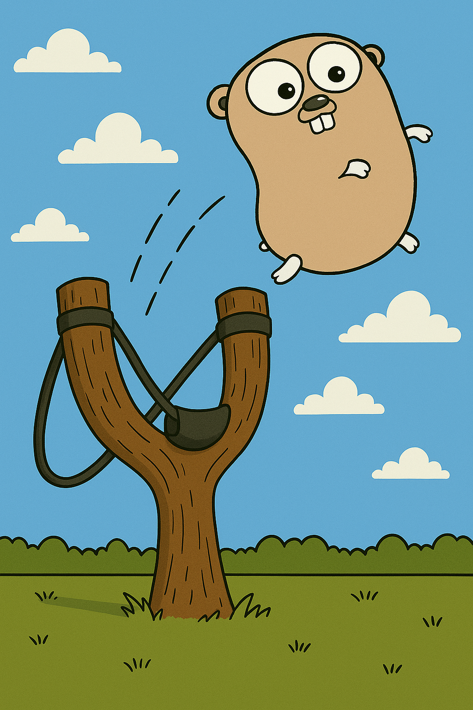

# Go and Throw



This is a fork of Go to address one of the most infamous issue with Go: the proliferation of
manual error propagation in the various forms of
```
if err != nil {
    return err
}
```

This fork introduces the "throw operator", `^`, which is used to propagate errors.

This operator may be used as the last LHS expressession in an assignment or define statement.

```go
^ = f()
i, ^ := g()
```
is the equivalent of
```go
var err error
err = f()
if err != nil {
    return err
}
i, err := g()
if err != nil {
    return err
}
```

`^` may be used in the context of a define statement, `:=`, but does not count as a new variable, so an error "no new variables on left side of :=" will be reported if a new variable is not present.
It must be the last variable in the list, and can only be used within a function whose return type is a tuple of the form `(..., error)`. 

`^` does not create a variable named "err" and does not conflict with nor change the value of any existing variable named "err".

Other return parameters are returned with their zero values. This includes cases where a func defines named return variables. Values that may have been assigned to the named return variables are not returned, but the zero values are instead when propagating an error.

Because this change is additive, it is fully compatible with existing Go code.

### Download and Install

#### Install From Source

Branch `throwOperator` contains the throw operator implementation from the master go branch.

Branch `throwOperator{version}` is based on the release branch of that version, e.g. `throwOperator1.24` is based on `release-branch.go1.24`.

For the same installation instructions as go, see https://go.dev/doc/install/source.